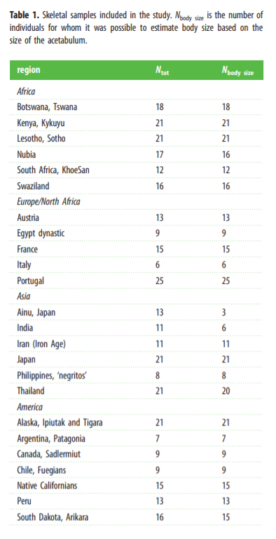

```{r setup, include=FALSE}
knitr::opts_chunk$set(echo = TRUE)
```

# Setup

Originally I was trying to open the file as an xl file and then realized it was zipped so that wasted a good chunk of time ooooops. The dataset is already a csv file which is great! I wanted to get it into the global environment.

```{r xl}
d <- read.csv("~/R/Data Replication/data.xlxs/Dataset.csv")
head(d)
summary(d)
```

Right off the bat I ran the summary function to correlate the information in the paper. Betti et al. claims there are 348 specimens in the sample and according to summary there are in fact 348 rows (whew!).

```{r testing}
library(dplyr)
library(tidyr)

byPop <- group_by(d, Population)#just wanted to get comfy with the data
byPop

dor <- d[order(-d$inlet.AP), ]
dor[1:10, ]
d[1:10, ]

inlet.AP <- c(d$inlet.AP)
inlet.ML <- d[c(d$inlet.ML), ]# i forgot why i tried to include this? I went with the above one but i remember wanting to make sure i wouldn't lose the id's for each specimen which wont matter when we avg
inlet.ML <- c(d$inlet.ML)
miplane.AP <- c(d$midplane.AP)
miplane.ML <- c(d$midplane.ML)
outlet.AP <- c(d$outlet.AP)
outlet.ML <- c(d$outlet.ML)
#i added this later and i think i mostly stuck to just referencing the columns as d$ but that's why i kept these in
```

# Methods and Analysis

These authors were extremely helpful in their methods!! The next step is to process the data and luckily, were using geometric mean- which we covered.  

>"From the raw data, inlet, midplane, and outlet indices were estimated by dividing the respective anteroposterior diameter by the mediolateral diameter, and the indices were used as canal shape data in all the analyses. Canal size was estimated as the sum of the geometric mean of the diameters in each plane. The geometric mean was preferred to the arithmetic mean because it uses a product of the canal diameters, therefore better resembling the area of the canal." (Betti et al.)  

So first I found the indices by manually dividing, no need for a formula!  
```{r index}
d$inlet.index <- d$inlet.AP/d$inlet.ML
d$midplane.index <- d$midplane.AP/d$midplane.ML
d$outlet.index <- d$outlet.AP/d$outlet.ML
summary(d)
head(d) #created index columns in the data frame

inlet.index<-d$inlet.index
midplane.index<-d$midplane.index #fun story i accidentally labeled this miplane originally and didn't notice because R would auto-suggest miplane instead of midplane
outlet.index<-d$outlet.index
#again I mostly used the d$ call but i just did this in case

```

For the next step, I though a formula would be better since I wanted to run it on the whole column. I went back to when we covered this exact topic in Mod 5!  
```{r geom}
gm <- function(x) {
    prod(x)^(1/length(x))
}
gm(d$inlet.index)# so this is the formula for geometric mean

#instead of x being one variable I need to put them all together
gmx<- c(d$inlet.index, d$midplane.index, d$outlet.index)
#this was a problem bc it doesn't separate the rows so...
```

The next part was tricky I wasn't sure how to do it exactly and I thought either I could basically do what I did above except sub out x in gm() with a vector of my columns- gmx[i]. OR I could do a for loop...  
```{r why fix what aint broke}
gmx1 <- c(d$inlet.index[1], d$midplane.index[1], d$outlet.index[1])
gm(gmx1)
#i would have to do this for each row and the best way would be for loops!

gmx348 <- c(d$inlet.index[348], d$midplane.index[348], d$outlet.index[348]) #for testing purposes
```

And in trying to do what I did above I realized for loops were for sure going to be the best way!
```{r because for loops babyyyy}
#d$canal.size.2 <- NULL  #thought i could make my null a new column? Actually tried this originally and found i didn't need it! The way i engineered the for loop already makes a new column.
for (i in 1:nrow(d)) {
  gmx <- c(d$inlet.index[i], d$midplane.index[i], d$outlet.index[i])
    d$canal.size[[i]] <- gm(gmx)
}

gm(gmx1)
d$canal.size[1]
gm(gmx348)
d$canal.size[348]
#success!

head(d) #when looking at the actual matrix all the values are there and I can subset them but the class is wrong
```

I wanted to fix the class so when I used head() it would show me the values instead of the list. I think this will also help with later analysis (it did). In going back through there was a lot of converting going on just to make the columns workable, class() is such a lifesaver!

```{r list to dbl}
class(d$Body.mass)
class(d$canal.size)

d$canal.size<- as.numeric(d$canal.size)
class(d$canal.size)#solved!
head(d)
```

Nice easy fix! Now I have my table ready for analysis! Its worth noting that in their original data they used several methods to determine body size based on the acetabulum where the femoral head connects with the pelvis. They have not included this data, just the calculated body masses so there is no way to determine if this is replicable.  
They also included analysis with external data sets from genetic and temperature based sites. For my replication I focused on the canal size and location data since it was the focus of my paper. However, I think they had some interesting graphs for genetic information/temp and they defended their choices well. It though it was interesting how they determined both temperatures and genetic/morphological information for their specimens since the period of the specimens is from BCE up until modern humans. Again, this is from supplementary datasets not included in the original, and they simply state their methods for choosing data so its not exactly replicable, although there is a better attempt made on this one for replication.  

## FigShare

Hey there! This is Marta from the future, I actually discovered that this article is more than just Dryad data, there is a site called figshare that allows for supplementary data tables that the article sites. I apologize in advance about the lateness of my replication, I only discovered this last minute and felt my replication was not complete if I didn't at least attempt to reconstruct some of this data. That being said I am really glad I found this! The authors did an amazing job making their work accessible and replicable which is great! I'm not sure if this is protected by a BU thing but here is the link to the [figshare page]("https://figshare.com/articles/journal_contribution/Supplementary_tables_Supplementary_figure_S1_Supplementary_figure_S2_from_Human_variation_in_the_shape_of_the_birth_canal_is_significant_and_geographically_structured/7204775?backTo=/collections/Supplementary_material_from_Human_variation_in_the_shape_of_the_birth_canal_is_significant_and_geographically_structured_/4265102").

A lot of the work in the FigShare was helpful later in my analysis after I had run some conversion on the data so it's a little disjointed. I will try and point out where I returned to figshare throughout the remainder of the doc!

## Grouping 

Looking at some of the graphs, I wanted to separate the groups out into lists so I tried a couple of methods for subsetting. I could use grep() to separate the Regions out but I wanted to also subset the populations. I tried to make list for that.

```{r grouping}
Asia <- d[grep("Asia", d$Region), ]
summary(Asia)
head(Asia) #this works really well for groups of the regions

Americas <- d[grep("Americas", d$Region), ]
Sub_saharan_Africa <- d[grep("Subsaharan Africa", d$Region), ]
Europe_and_North_Africa <- d[grep("Europe and North Africa", d$Region), ]

#in looking for subsetting help i rediscovered this dplyr trick!
byRegion <- group_by(d, Region)
byRegion
```

Subsetting proved more difficult without manual lists.
```{r asia}
Thailand <- d[grep("Thailand", d$Population), ] #I can do each indiv. population but I can't subset them as part of the "Asia" dataframe
Ainu <- d[grep("Ainu", d$Population), ]
India <- d[grep("India", d$Population), ]
Iran <- d[grep("Iran", d$Population), ]
Japan <- d[grep("Japan", d$Population), ]
Philippines_negritos <- d[grep("Philippines negritos", d$Population), ]

byPop <- group_by(d, Population)
byPop
#this seems to be the best way to group things, unfortunately I can't figure out how to nest the byPop in byRegion since the rows can't have duplicate names

byRegion$Population<- as.factor(byRegion$Population)
#by I can create a factor vector within byRegion- it just doesn't nest the tree
```

After individually grouping things I wanted to go ahead and make a data frame with just the info I would be using to graph.  
```{r spop}
spop <- summarise(byPop,  inlet.index = mean(inlet.index, na.rm = TRUE), midplane.index = mean(midplane.index, na.rm = TRUE), outlet.index = mean(outlet.index, na.rm = TRUE), canal.size = mean(canal.size, na.rm = TRUE))
spop #this creates a workable tibble based on byPop
spop<- as.data.frame(spop) #converting to df
spop$Region <- list("Asia", "Americas", "Americas", "Europe_and_North_Africa", "Subsaharan_Africa", "Americas", "Europe_and_North_Africa", "Europe_and_North_Africa", "Americas", "Asia", "Asia", "Europe_and_North_Africa", "Asia", "Subsaharan_Africa", "Subsaharan_Africa", "Subsaharan_Africa", "Europe_and_North_Africa", "Americas", "Americas", "Asia", "Europe_and_North_Africa", "Americas", "Subsaharan_Africa", "Asia")
spop$Region <- as.character(spop$Region) #at first I converted the list into a character vector
spop$Region <- as.factor(spop$Region)
```

I'll note it later but i needed this as a factor vector in order to label points in one of my graphs. I found this [website]("http://www.sthda.com/english/wiki/scatterplot3d-3d-graphics-r-software-and-data-visualization") on the scatterplot3d package super useful for my graphs. One thing I am proud of figuring out was this factor problem. In their example dataset (included in the package) they were able to use labels from a character vector (which didn't work for me). Again, I used class() to determine that their data was actual a factor vector so I was able to fix it in my own data frame!

Now is where I return to figshare, I manually created a file with the supplemental info from Table S2 named figdata and converted it to a workable dataframe.

```{r figshare1}
f <- "~/R/Data Replication/data.xlxs/figdata"
figd <- read.csv(f, header = TRUE)
head(figd)
colnames(figd) <- c("Population", "Longitude", "Latitude", "Min. Temperature (\u00B0C)", "Max Temperature (\u00B0C)")# I wanted the temp column names corrected
head(figd)
```

## Table 1

Originally I moved straight to graphs but I came back to this section to try and replicate the table print out from the article.

```{r tables}
library(kableExtra)
```

Packages loaded...  
```{r tables cont}
dtable<- data.frame("Region" = c("Botswana, Tswana", "Kenya, Kykuyu", "Lesotho, Sotho", "Nubia", "South Africa, KhoeSan", "Swaziland", "Austria", "Egypt dynastic", "France", "Italy", "Portugal", "Ainu, Japan", "India", "Iran (Iron Age)", "Japan", "Philippines, ‘negritos’", "Thailand", "Alaska, Ipiutak and Tigara", "Argentina, Patagonia", "Canada, Sadlermiut", "Chile, Fuegians", "Native Californians", "Peru", "South Dakota, Arikara"), "N (tot)" = c(18, 21, 21, 17, 12, 16, 13, 9, 15, 6, 25, 13, 11, 11, 21, 8, 21, 21, 7, 9, 9, 15, 13, 16), "N (body size)" = c(18, 21,	21, 16,	12, 16, 13, 9, 15, 6, 25, 3, 6, 11, 21, 8, 20, 21, 7, 9, 9, 15, 13, 15))
colnames(dtable) <- c("Region", expression(N["tot"]), expression(N["body size"]))
kable(dtable, caption = "Table 1: Total number of skeletons and number of skeletons with body size") %>%
  kable_styling(full_width = F) %>%    
  pack_rows("Africa", 1, 6, color = "green", background = "white", italic = T) %>%
  pack_rows("Europe/North Africa", 7, 11, color = "green", background = "white", italic = T) %>%
  pack_rows("Asia", 12, 17, color = "green", background = "white", italic = T) %>%
  pack_rows("America", 18, 24, color = "green", background = "white", italic = T) %>%
  row_spec(0, bold = T, color = "white", background = "green") %>%
  row_spec(1:24, color = "black", background = "white")
```

[Table 1](https://github.com/sinnabunbun/martah-data-replication-assignment/blob/main/img/Table1.png)


Great! I think the kableExtra package is super helpful, the table looks awesome and it was super easy to make.

And the supplemental table...  
```{r figshare2}
figd %>%
  kbl(caption = "Table 2") %>%
  kable_classic(full_width = F, html_font = "Cambria") %>%
  row_spec(0, bold = T)
```

[Table S2](https://github.com/sinnabunbun/martah-data-replication-assignment/blob/main/img/TableS2.png)


Nice, Both of the tables came out great!

# Graphing

## Figure 2

Now the fun stuff! This first graph I wanted to try and replicate was the boxplots in Figure 2

```{r boxplots, fig.width=6, fig.height=14}
d$Region<-factor(d$Region, levels = c("Subsaharan Africa", "Europe and North Africa", "Asia", "Americas"), labels = c("Subsaharan Africa", "Europe and North Africa", "Asia", "Americas"))#i needed to flip the x axis
par(mfrow = c(3, 1))
boxplot(data = d, inlet.index ~ Region, range=1.25, ylab = "Inlet AP/ML")
boxplot(data = d, midplane.index ~ Region, range=1.25, ylab = "Midplane AP/ML")
boxplot(data = d, outlet.index ~ Region, range=1.5, ylab = "Outlet AP/ML")
```

[Fig 2](https://github.com/sinnabunbun/martah-data-replication-assignment/blob/main/img/Fig2.jpg)


I think this came out really good, I tried messing around with the range because the article says the IQR is 1.5 but there are outliers that are missing in that. I think some of the ranges are closer to 1.25 but I'm going to stick with the normal range for authenticity. I also think they added in their colored post-hoc Tukey lines and the opening shapes on the y-axis after creating the box-plots. 

## Figure 3

```{r 3d}
library(plotly)
library(plot3D)
library(scatterplot3d)
#some of the packages that made it all the way to the end! I used scaterplot3d but here is just a sample of some of the packages i tried out before landing on that one :)
```

This was actually my favorite part, I choose this article because of the topic and the boxplots from above since I was comfortable with that. Here however, was a really fun challenge! We didn't really work with 3D (unless I am forgetting something) so I spent a lot of time just looking around for the best fit out of a lot of the packages available. There is some really cool 3D modeling available on R, I hope to use this again in the future! I'm really glad they had this because I go to flex a lot of my problem solving skills. I'm also probably glad because it came out great I'm sure it would be a different story if the graphs didn't line up XD.

```{r}
colors <- c("#2283bf", "#ede215", "#cc1818", "#357d1a")#corresponds to the article colors
colors <- colors[as.numeric(spop$Region)] #this is where having as.factor was important
s3d<-scatterplot3d(spop[,2:4], color=colors, angle = 70, pch = 16, grid=TRUE, box=FALSE, type="h", scale.y = 1.8, xlab = "Inlet AP/ML", ylab = "Midplane AP/ML", zlab = "Outlet AP/ML")
text(s3d$xyz.convert(spop[, 2:4]), labels = spop$Population, cex= 0.85, pos=3)
```

[Fig 3](https://github.com/sinnabunbun/martah-data-replication-assignment/blob/main/img/Fig3.jpg)


I am so proud of how this turned out. All the axes were calculated by me and I figured out the parameters of scatterplo3d() to fix everything how I wanted it! And it looks great!! The biggest differences is I think the manually specified their labels because they changed some of the labels and were able to move them around so they don't overlap in some places.

## Figure 4

The last figure was kind of a rush because this was one I found the figshare data. I was some really simple scatterplots so I took two of the ones with data we already had transformed.
```{r fig4, fig.height=10, fig.width=7}
par(mfrow = c(2, 1))
figd$inlet.index <- c(spop$inlet.index)
x <- figd$`Min. Temperature (°C)`
y <- figd$inlet.index
plot(x, y, xlab = "Min. Temperature (°C)", ylab = "inlet AP/ML")
abline(lm(y ~ x, data = figd), col = "red")
#the second one needed some more set up
domit<-na.omit(d)#some body masses were missing in the original data so i went and removed those rows
lm2 = lm(canal.size ~ Body.mass, data=domit) 
lm2.res = resid(lm2)
plot(domit$Body.mass, lm2.res, ylab="Residuals", xlab="Body Mass") 
```

[Fig 4](https://github.com/sinnabunbun/martah-data-replication-assignment/blob/main/img/Fig4.jpg)


Very nice!

# Concluding Remarks

I thought this assignment was great and really does feel like a culmination of all my coding knowledge. I had originally critiques the article because there was not all the datasets online but I had never even heard of FigShare before. It did make some of figures a little rushed but I'm really glad I found it because it helps me understand the scientific article process better. This was a great article to replicate, I think the analysis and graphs were just difficult enough to be challenging but not so hard that I felt overwhelmed. I would like to try and do this again in the future, and I can't wait to see how my own data can be interpreted!
